# Design Document v2.0

## Overview

IDEAZEN is implemented as a sophisticated dual-mode single-page React application with TypeScript support, featuring advanced AI integration, multi-agent coordination, and real-time collaboration capabilities. The system employs a state machine pattern with fourteen distinct screens across two operational modes: Regular Mode (self-paced learning) and Hackathon Mode (time-sensitive competitive builds).

The architecture leverages cutting-edge AI services including GPT-4 Vision for screenshot-to-code conversion, Claude Sonnet for multi-agent coordination, ElevenLabs for voice synthesis, and specialized microservices for deployment automation and real-time progress tracking. The frontend integrates seamlessly with browser APIs, local storage, and cloud deployment platforms while maintaining offline-first capabilities for resilience.

The system prioritizes developer experience through intelligent automation, proactive AI assistance, responsive design with mobile-first architecture, semantic color systems, and progressive disclosure of complexity. Context preservation and iterative refinement enable fluid user journeys without data loss.

## Architecture

### System Architecture

```mermaid
graph TB
    subgraph "Frontend (React + TypeScript + Vite)"
        A[App.tsx - Dual-Mode State Machine] --> B[Landing Page]
        A --> C[Mode Selection]
        A --> D[Regular Mode Flow]
        A --> E[Hackathon Mode Flow]
        
        D --> D1[Skill Selection]
        D --> D2[Question Flow]
        D --> D3[Idea Generation]
        D --> D4[Idea Preview]
        D --> D5[Blueprint Generation]
        D --> D6[Project Output]
        
        E --> E1[Problem Upload]
        E --> E2[Context Questions]
        E --> E3[Strategy Generation]
        E --> E4[Roadmap Display]
        E --> E5[Live Dashboard]
        E --> E6[Submission Generator]
        
        A --> F[My Ideas]
        A --> G[Navbar Component]
        A --> H[Footer Component]
        A --> I[AI Agent Panel]
        A --> J[Vision Uploader]
    end
    
    subgraph "State Management"
        K[App Mode State: regular/hackathon]
        L[Current Screen State]
        M[User Inputs State]
        N[Generated Project State]
        O[Generated Ideas Array]
        P[Hackathon Context State]
        Q[Progress Tracking State]
        R[Agent Status State]
    end
    
    subgraph "AI Services Layer"
        S[Claude API - Project Generation]
        T[GPT-4 Vision - Image to Code]
        U[Multi-Agent Orchestrator]
        V[Code Analysis Engine]
        W[OCR Service - PDF/Image]
        X[ElevenLabs - Voice Synthesis]
    end
    
    subgraph "Automation Services"
        Y[GitHub Integration]
        Z[Deployment Pipeline - Vercel/Railway]
        AA[Video Generator Service]
        AB[Export Generator]
    end
    
    subgraph "Storage & Persistence"
        AC[Browser localStorage]
        AD[IndexedDB - Large Files]
        AE[Session Storage - Temp Data]
    end
    
    A --> K
    A --> L
    A --> M
    A --> N
    A --> O
    A --> P
    A --> Q
    A --> R
    
    D --> S
    E --> S
    J --> T
    I --> U
    D6 --> V
    E1 --> W
    E6 --> X
    
    D6 --> Y
    E5 --> Z
    E6 --> AA
    D6 --> AB
    E6 --> AB
    
    F --> AC
    E5 --> AD
    A --> AE
```



### Technology Stack

**Frontend Framework:**
- React 18.3+ with concurrent features and Suspense
- TypeScript 5.0+ for full type safety (migration from JSX)
- Vite 5.0+ as build tool with hot module replacement and code splitting
- React Router 6.0+ for client-side routing with nested routes

**Styling and UI:**
- Tailwind CSS v4.0 with custom design tokens and dark mode support
- CSS Custom Properties in globals.css for semantic color system
- Framer Motion for smooth animations and page transitions
- Lucide React for consistent iconography throughout the application
- Radix UI primitives for accessible component foundations

**State Management:**
- Zustand for lightweight global state management
- React Query (TanStack Query) for server state and caching
- React Context for theme and mode switching
- localStorage with state hydration for persistence

**AI Integration:**
- Anthropic Claude API for project generation and multi-agent coordination
- OpenAI GPT-4 Vision API for screenshot-to-code conversion
- Custom prompt engineering with few-shot examples
- Response streaming for real-time generation feedback

**File Handling:**
- react-dropzone for drag-and-drop uploads
- Tesseract.js for client-side OCR fallback
- pdf.js for PDF parsing and text extraction
- HTML5 Canvas API for image manipulation

**Code Generation:**
- Prettier for code formatting in generated files
- ESLint configuration generation
- Template engine for boilerplate creation
- AST manipulation for code injection

**Deployment Integration:**
- Vercel SDK for automatic deployments
- Railway API for full-stack deployments
- GitHub REST API for repository creation
- Netlify SDK for static site deployment

**Video/Media Processing:**
- FFmpeg.wasm for client-side video editing
- MediaRecorder API for screen recording
- ElevenLabs API for text-to-speech voiceovers
- Canvas API for thumbnail generation

**Data Persistence:**
- Browser localStorage for projects (max 10MB)
- IndexedDB for large files and code archives
- Export to Markdown, PDF, JSON, CSV formats
- Import/export for data portability

**Analytics & Monitoring:**
- Custom event tracking (privacy-focused, no third-party)
- Performance monitoring with Web Vitals
- Error boundary with automatic reporting
- Console logging in development mode only

### Screen State Machine

The application implements a finite state machine with fourteen screens across two modes:

#### **Regular Mode Screens (8 screens):**

1. **landing** - Dual-mode hero with feature showcase
2. **mode-selection** - Choose Regular or Hackathon Mode
3. **skill-selection** - Three-card skill level picker
4. **questions** - Adaptive questionnaire (4-6 questions)
5. **generating-ideas** - First loading screen for project options
6. **idea-preview** - Selection interface showing 2-4 options
7. **generating-blueprint** - Second loading for detailed blueprint
8. **output** - Complete project display with mentor controls

#### **Hackathon Mode Screens (6 screens):**

1. **problem-upload** - Multi-format problem statement input
2. **hackathon-questions** - 6 context questions for strategy
3. **generating-strategy** - Loading screen for battle plan
4. **strategy-display** - Winning approach and roadmap
5. **live-dashboard** - Real-time progress tracking
6. **submission-package** - Auto-generated deliverables

#### **Shared Screens (2 screens):**

1. **my-ideas** - Saved projects management (both modes)
2. **project-comparison** - Side-by-side analysis

State transitions use URL-based routing with state preservation via localStorage for recovery.

## Components and Interfaces

### Core Application Components

**App.tsx (Root Container)**
- Manages global application mode (regular/hackathon)
- Handles routing and navigation state
- Provides AI service context to all children
- Implements error boundaries for graceful failures
- Manages authentication state (future feature)
- Coordinates multi-agent system initialization

```typescript
interface AppState {
  mode: 'regular' | 'hackathon';
  currentScreen: ScreenType;
  userInputs: UserInputs | HackathonContext;
  generatedProject: GeneratedProject | null;
  generatedIdeas: ProjectIdea[];
  agentStatuses: AgentStatus[];
  progressData: ProgressTracking | null;
}
```

**ModeSelection Component**
- Side-by-side comparison of Regular vs Hackathon modes
- Animated gradient cards with hover effects
- Clear value propositions for each mode
- Visual differentiation: Blue gradient (Regular), Orange gradient (Hackathon)
- One-click mode selection with smooth transition

**Navbar Component**
- Sticky navigation with mode-aware styling
- Glassmorphic backdrop blur with transparency
- Logo returns to landing, maintains state
- My Ideas navigation with project count badge
- Generate button with mode indicator
- Hamburger menu on mobile (<768px)
- Command palette trigger (Ctrl+K)
- Mode switcher in top-right corner

### Regular Mode Components

**LandingPage Component**
- Hero section with animated gradient background
- Dual CTA buttons: "Start Building" (Regular), "Hack Mode" (Hackathon)
- How It Works visualization with three steps
- Features showcase (six cards with icons)
- Example projects carousel with auto-scroll
- FAQ accordion with smooth expand/collapse
- Social proof section (testimonials, stats)
- Footer with links and branding

**SkillLevelSelection Component**
- Three skill cards with semantic gradients
- AI recommendation badge with glow on Beginner
- Hover effects with lift and shadow
- Icon representation for each level
- Clear descriptions with example projects
- Progress indicator showing "Step 1 of 5"
- Reassurance messaging at bottom

**QuestionFlow Component**
- Dynamic question rendering based on skill level
- Progress bar with gradient fill and percentage
- Question cards with icons and semantic colors
- Single-select with radio buttons
- Multi-select with checkboxes (technologies, architecture)
- Input validation before enabling Continue
- Back button preserves previous answers
- Mobile-optimized single-column layout

**IdeaPreview Component**
- Grid display of 2-4 generated project options
- Project cards with gradient borders
- Title, difficulty badge, confidence score
- 3-4 feature highlights per option
- Brief description (2-3 sentences)
- "Why This Works" reasoning snippet
- Hover effects with scale and shadow
- Selection triggers blueprint generation

**ProjectOutput Component (Regular Mode)**
- Gradient hero header with project title
- Difficulty badge and feasibility rating
- AI reasoning section (expandable)
- Feature list with icons and descriptions
- Interactive tech stack visualizer (new)
- Collapsible roadmap with phase timeline
- Learning outcomes with resource links
- Export options dropdown
- AI Mentor Controls sidebar:
  - Refine Idea
  - Make It Harder
  - Simplify It
  - Generate New Idea
  - Explain More
  - Show Code Kickstarter
- Save to My Ideas button
- Share functionality with unique URL

### Hackathon Mode Components

**ProblemStatementUpload Component**
- Multi-tab interface: PDF, Image, Text, URL
- Drag-and-drop zone with visual feedback
- File size validation (max 10MB)
- OCR progress indicator for images
- URL scraping with loading state
- Preview of extracted text
- Edit extracted text option
- AI analysis summary display:
  - Main Challenge
  - Must-Have Features
  - Constraints
  - Judging Criteria
  - Winning Opportunities
- Continue to context questions

**HackathonQuestions Component**
- 6 quick questions (<2 min total)
- Team configuration with visual team size
- Skill matrix with proficiency sliders
- Timeline selector with calendar integration
- Submission requirements checklist
- Resources input with autocomplete
- Priority selection with explanations
- Progress bar specific to hackathon flow
- Emergency skip option (uses defaults)

**StrategyDisplay Component**
- Hero section with "Winning Angle" statement
- Why This Wins explanation with criteria mapping
- Critical Success Factors checklist
- Smart Scope Recommendations:
  - MUST BUILD (60% - green)
  - SHOULD BUILD (25% - blue)
  - NICE TO HAVE (15% - yellow)
  - DON'T BUILD (0% - red strikethrough)
- Risk Assessment accordion:
  - Technical Risks
  - Time Risks
  - Team Risks
  - Mitigation Strategies
- Hour-by-hour roadmap visualization:
  - Phase cards with time ranges
  - Parallel work streams by team member
  - Checkpoint markers
  - Buffer time indicators
  - Break reminders
- Start Tracking button → Live Dashboard

**LiveDashboard Component (Critical New Feature)**
- Persistent countdown timer (top center)
- Overall progress ring chart
- Current phase status indicator
- Next milestone countdown
- Team member status cards:
  - Avatar/name
  - Current task
  - Progress percentage
  - Status (on-track/behind/blocked)
- Alert panel with AI recommendations
- Completion tracker checklist:
  - Checkbox for each deliverable
  - Progress bars for in-progress items
  - Timestamps for completed items
- Quick actions:
  - Mark Task Done
  - Report Blocker
  - Request Help
  - Revise Roadmap
- Mobile-optimized vertical layout
- Real-time sync with localStorage
- Export progress report

**SubmissionPackageGenerator Component**
- Tabbed interface for deliverables:
  - Pitch Deck
  - Demo Script
  - GitHub README
  - Video Storyboard
  - Social Posts
- Live preview of generated content
- Customization editors for each asset
- Export options (PDF, PPTX, MD, ZIP)
- One-click DevPost submission preparation
- GitHub repo auto-creation with push
- Video demo generator sub-component:
  - Screen recording interface
  - Script editor with timing
  - Voice selection (AI voices)
  - Background music picker
  - Generate button
  - Video preview player
  - Export formats (MP4, WebM)

### AI-Powered Components (New)

**VisionToCodeUploader Component**
- Drag-and-drop for sketches/screenshots
- Text input for UI descriptions
- Framework selector (React, Vue, Svelte)
- Style preference (Tailwind, CSS Modules, Styled)
- Generate button with loading animation
- Split-panel output:
  - Live preview (left)
  - Code editor (right)
- Code syntax highlighting
- Copy/download buttons
- Iteration feedback input
- "Generate Variations" option

**MultiAgentPanel Component**
- Sidebar or bottom panel (toggleable)
- Agent cards with status indicators:
  - 🧑‍💻 Backend Agent (purple)
  - 🎨 Frontend Agent (blue)
  - 🎨 Designer Agent (pink)
  - 🔧 DevOps Agent (green)
  - ✅ QA Agent (yellow)
  - 📊 PM Agent (orange)
- Chat interface per agent:
  - Message history
  - Input field
  - Quick action buttons
  - Code block rendering
- Agent availability status
- Coordinated task view showing dependencies
- Agent handoff notifications
- Collapse/expand functionality

**AICodeCopilot Component**
- Floating widget (bottom-right)
- Minimize/expand controls
- Context display (current file, phase)
- Suggestion cards:
  - Issue description
  - Severity (critical/warning/info)
  - Auto-fix button
  - Explain button
- Quick help shortcuts:
  - "Add error handling"
  - "Write tests"
  - "Optimize performance"
  - "Explain this code"
- Voice command button (future)
- History of suggestions
- Dismiss/snooze options

**TechStackVisualizer Component (Enhanced)**
- Interactive node-based diagram
- Technologies as nodes with icons
- Arrows showing data flow
- Color coding by category:
  - Frontend (blue)
  - Backend (green)
  - Database (purple)
  - External APIs (orange)
- Hover interactions:
  - Technology name
  - Role description
  - Popularity percentage
  - Alternatives button
- Click actions:
  - "Why this?" explanation
  - Swap technology
  - View documentation
- Zoom/pan controls
- Export as PNG/SVG
- Responsive layout (tree on mobile)

**CodeKickstarterModal Component (New)**
- Modal overlay with project preview
- Folder tree structure visualization
- File content previews (syntax highlighted)
- Technologies included checklist
- Configuration options:
  - Package manager (npm/yarn/pnpm)
  - Git initialization (yes/no)
  - Environment variables
  - Linting/formatting
- Download options:
  - ZIP file
  - Create GitHub repo
  - Open in StackBlitz
  - Copy to clipboard
- Generate button with progress
- Close/cancel controls

**LearningResourcePanel Component (New)**
- Collapsible sidebar or modal
- Tech stack learning roadmap
- Resource cards per technology:
  - Tutorial links (YouTube, docs)
  - Estimated time
  - Difficulty indicator
  - Prerequisites
  - Community links
- Progress tracking checkboxes
- Prerequisite quiz trigger
- "Start Learning" CTA per resource
- Filter by completed/pending
- Search functionality

### Shared Components

**GeneratingScreen Component**
- Mode-aware titles and steps
- Animated gradient background
- Brain icon with pulse animation
- Progress timeline:
  - Horizontal on desktop
  - Vertical on mobile
- 5 steps with checkmarks
- Estimated time remaining
- Fun facts/tips during generation
- Cancel option (with confirmation)

**MyIdeas Component (Enhanced)**
- Filter tabs: All, Regular, Hackathon, In Progress, Completed
- Search bar with live filtering
- Sort options: Recent, Difficulty, Confidence
- Project cards with mode badges
- Action buttons:
  - View
  - Delete
  - Duplicate
  - Export
  - Share
- Comparison mode toggle
- Bulk actions (select multiple)
- Empty state with CTA
- Pagination for 20+ projects

**ComparisonView Component (New)**
- Side-by-side layout (2 projects max)
- Synchronized scrolling
- Comparison highlights:
  - Difficulty difference
  - Time estimates
  - Tech stack overlap
  - Confidence scores
  - Feature counts
- Winner indicators (visual)
- Export comparison as PDF
- Clear comparison button

**ExportModal Component (Enhanced)**
- Format selection (multi-select):
  - PDF (formatted blueprint)
  - Markdown (GitHub)
  - JSON (raw data)
  - Notion template
  - Trello/Jira import
  - CSV (roadmap)
- Preview before export
- Customization options:
  - Include/exclude sections
  - Branding toggle
  - Date format
- Export button with progress
- Download link with expiry
- Copy to clipboard fallback

### UI Component Library

**Button Component**
- Variants: primary, secondary, ghost, danger, success
- Sizes: sm, md, lg, xl
- States: default, hover, active, disabled, loading
- Icons: left, right, icon-only
- Full-width option
- Gradient option for CTAs
- Keyboard focus styles

**Card Component**
- Base card with padding options
- Header, body, footer slots
- Gradient border option
- Hover lift effect
- Click handler support
- Loading skeleton state
- Responsive padding adjustments

**Badge Component**
- Color variants matching semantic system
- Sizes: sm, md, lg
- Icon support
- Pill vs rounded variants
- Dismissible option
- Pulse animation option

**ProgressBar Component**
- Determinate progress (0-100%)
- Indeterminate animation
- Gradient fill option
- Label positioning
- Striped animation
- Size variants

**Accordion Component**
- Single or multiple expansion
- Animated height transitions
- Icon rotation on expand
- Nested accordion support
- Controlled/uncontrolled modes
- Keyboard navigation

**Modal Component**
- Overlay with backdrop blur
- Close on overlay click (configurable)
- Close button (X)
- Size variants: sm, md, lg, xl, full
- Scroll behavior: inside modal or page
- Animation: fade + scale
- Escape key to close
- Focus trap for accessibility

**Toast/Notification Component**
- Position: top-right, top-center, bottom-right, bottom-center
- Variants: success, error, warning, info
- Auto-dismiss with timer
- Progress bar for timer
- Action buttons
- Queue management
- Swipe to dismiss (mobile)

## Data Models

### User Input Data Models

**Regular Mode - UserInputs Interface**
```typescript
interface UserInputs {
  skillLevel: 'beginner' | 'intermediate' | 'advanced';
  domain: string; // web, mobile, game, automation, etc.
  learningGoal: string; // frontend, backend, fullstack, etc.
  timeAvailability: string; // 2 weeks to 3+ months
  deployment?: string; // for beginner/intermediate
  technologies?: string[]; // for intermediate/advanced
  architecture?: string[]; // for advanced
  scalability?: string; // for advanced
  constraints?: string; // for advanced
  difficultyStretch?: string; // for beginner
  teamSize?: string; // for advanced
}
```

**Hackathon Mode - HackathonContext Interface**
```typescript
interface HackathonContext {
  problemStatement: {
    rawText: string;
    extractedFrom: 'pdf' | 'image' | 'text' | 'url';
    sourceUrl?: string;
  };
  analysis: {
    mainChallenge: string;
    mustHaveFeatures: string[];
    constraints: string[];
    judgingCriteria: { criterion: string; weight: number }[];
    winningOpportunities: string[];
  };
  team: {
    size: 1 | 2 | 3 | 4 | 5;
    members: TeamMember[];
  };
  timeline: {
    duration: 24 | 36 | 48 | 72 | number;
    startTime: string; // ISO timestamp
    endTime: string; // ISO timestamp
  };
  submission: {
    demoRequired: boolean;
    deckRequired: boolean;
    videoRequired: boolean;
    repoRequired: boolean;
    deploymentRequired: boolean;
    presentationTime: number; // minutes
  };
  resources: {
    allowedAPIs: string[];
    budget: number;
    preExistingCodeAllowed: boolean;
    deploymentPlatforms: string[];
    bannedTechnologies: string[];
  };
  priority: 'win' | 'learn' | 'mvp' | 'network';
}

interface TeamMember {
  role: 'backend' | 'frontend' | 'design' | 'ml' | 'devops' | 'fullstack';
  proficiency: 'beginner' | 'intermediate' | 'expert';
  name?: string; // optional
}
```

### Project Generation Data Models

**GeneratedProject Interface (Regular Mode)**
```typescript
interface GeneratedProject {
  id: string;
  mode: 'regular';
  title: string;
  difficulty: 'Beginner' | 'Intermediate' | 'Advanced';
  description: string;
  reasoning: string;
  features: Feature[];
  techStack: TechStack;
  roadmap: RoadmapPhase[];
  skillOutcomes: SkillOutcome[];
  feasibility: 'High' | 'Medium' | 'Low';
  confidence: number; // 0-100
  estimatedTime: string; // "4-6 weeks"
  prerequisites: string[];
  resources: LearningResource[];
  architecture: ArchitectureDiagram;
  codeKickstarter: CodeScaffolding;
  createdAt: string; // ISO timestamp
  updatedAt: string; // ISO timestamp
}

interface Feature {
  id: string;
  title: string;
  description: string;
  complexity: 'low' | 'medium' | 'high';
  estimatedHours: number;
  dependencies: string[]; // feature IDs
}

interface TechStack {
  primary: Technology[];
  alternative: Technology[];
  rationale: string;
}

interface Technology {
  name: string;
  category: 'frontend' | 'backend' | 'database' | 'devops' | 'external';
  version?: string;
  purpose: string;
  popularity: number; // 0-100
  learningCurve: 'easy' | 'moderate' | 'steep';
}

interface RoadmapPhase {
  phase: number;
  title: string;
  description: string;
  duration: string;
  tasks: Task[];
  checkpoints: string[];
}

interface Task {
  id: string;
  title: string;
  description: string;
  estimatedHours: number;
  priority: 'must' | 'should' | 'nice';
}

interface SkillOutcome {
  skill: string;
  description: string;
  resources: LearningResource[];
  quiz?: PrerequisiteQuiz;
}

interface LearningResource {
  type: 'video' | 'article' | 'course' | 'docs' | 'community';
  title: string;
  url: string;
  estimatedMinutes: number;
  difficulty: 'beginner' | 'intermediate' | 'advanced';
  free: boolean;
}

interface ArchitectureDiagram {
  nodes: ArchitectureNode[];
  edges: ArchitectureEdge[];
}

interface ArchitectureNode {
  id: string;
  label: string;
  technology: string;
  category: string;
  position: { x: number; y: number };
}

interface ArchitectureEdge {
  from: string;
  to: string;
  label?: string;
  dataFlow: 'unidirectional' | 'bidirectional';
}

interface CodeScaffolding {
  framework: string;
  structure: FileNode[];
  installCommands: string[];
  runCommands: string[];
  envVariables: string[];
}

interface FileNode {
  path: string;
  type: 'file' | 'directory';
  content?: string; // for files
  children?: FileNode[]; // for directories
}
```

**HackathonStrategy Interface (Hackathon Mode)**
```typescript
interface HackathonStrategy {
  id: string;
  mode: 'hackathon';
  winningAngle: string;
  whyThisWins: string[];
  criticalSuccessFactors: string[];
  scope: {
    mustBuild: ScopeItem[];
    shouldBuild: ScopeItem[];
    niceToHave: ScopeItem[];
    dontBuild: string[];
  };
  risks: {
    technical: Risk[];
    time: Risk[];
    team: Risk[];
  };
  roadmap: HackathonPhase[];
  submissionPackage: SubmissionPackage;
  createdAt: string;
  updatedAt: string;
}

interface ScopeItem {
  feature: string;
  reason: string;
  estimatedHours: number;
  dependencies: string[];
}

interface Risk {
  description: string;
  probability: 'low' | 'medium' | 'high';
  impact: 'low' | 'medium' | 'high';
  mitigation: string;
}

interface HackathonPhase {
  phaseNumber: number;
  title: string;
  hourRange: string; // "0-6"
  description: string;
  workStreams: WorkStream[];
  checkpoint: string;
  bufferHours: number;
  breaks: Break[];
}

interface WorkStream {
  teamMember: string; // role
  tasks: string[];
  estimatedHours: number;
  dependencies: string[];
}

interface Break {
  afterHour: number;
  duration: number; // minutes
  type: 'short' | 'meal' | 'sleep';
  mandatory: boolean;
}

interface SubmissionPackage {
  pitchDeck: PitchDeck;
  demoScript: DemoScript;
  readme: string; // markdown
  videoStoryboard: VideoStoryboard;
  socialPosts: SocialPost[];
}

interface PitchDeck {
  slides: Slide[];
  format: 'pptx' | 'pdf';
  downloadUrl?: string;
}

interface Slide {
  title: string;
  content: string;
  layout: 'title' | 'content' | 'image' | 'chart';
  notes?: string;
}

interface DemoScript {
  totalSeconds: 90;
  sections: ScriptSection[];
}

interface ScriptSection {
  timeRange: string; // "0-15s"
  title: string;
  script: string;
  screenAction: string;
}

interface VideoStoryboard {
  shots: Shot[];
  voiceoverScript: string;
  musicSuggestions: string[];
  editingTips: string[];
}

interface Shot {
  shotNumber: number;
  timestamp: string;
  description: string;
  screenAction: string;
  duration: number;
}

interface SocialPost {
  platform: 'linkedin' | 'twitter' | 'devto';
  content: string;
  hashtags: string[];
}
```

### Progress Tracking Data Model

**ProgressTracking Interface**
```typescript
interface ProgressTracking {
  projectId: string;
  mode: 'regular' | 'hackathon';
  status: 'not-started' | 'in-progress' | 'completed' | 'abandoned';
  startedAt: string; // ISO timestamp
  completedAt?: string; // ISO timestamp
  currentPhase: number;
  completedTasks: string[]; // task IDs
  inProgressTasks: string[]; // task IDs
  blockers: Blocker[];
  notes: Note[];
  screenshots: Screenshot[];
  timeTracking: TimeEntry[];
  overallProgress: number; // 0-100
  phases: PhaseProgress[];
}

interface Blocker {
  id: string;
  description: string;
  reportedAt: string;
  resolvedAt?: string;
  aiSuggestions: string[];
  resolved: boolean;
}

interface Note {
  id: string;
  phaseId: string;
  taskId?: string;
  content: string;
  createdAt: string;
  tags: string[];
}

interface Screenshot {
  id: string;
  phaseId: string;
  imageUrl: string; // base64 or blob URL
  caption: string;
  uploadedAt: string;
}

interface TimeEntry {
  id: string;
  phaseId: string;
  taskId?: string;
  startTime: string;
  endTime?: string;
  durationMinutes: number;
}

interface PhaseProgress {
  phaseId: string;
  status: 'not-started' | 'in-progress' | 'completed';
  startedAt?: string;
  completedAt?: string;
  actualHours: number;
  estimatedHours: number;
}
```

### AI Agent Data Models

**AgentStatus Interface**
```typescript
interface AgentStatus {
  agentType: 'backend' | 'frontend' | 'design' | 'devops' | 'qa' | 'pm';
  status: 'idle' | 'thinking' | 'working' | 'completed' | 'error';
  currentTask?: string;
  progress: number; // 0-100
  estimatedCompletion?: string; // ISO timestamp
  outputs: AgentOutput[];
  conversationHistory: Message[];
}

interface AgentOutput {
  type: 'code' | 'diagram' | 'suggestion' | 'analysis';
  content: string | object;
  timestamp: string;
  language?: string; // for code
  filePath?: string; // for code
}

interface Message {
  id: string;
  sender: 'user' | 'agent';
  content: string;
  timestamp: string;
  attachments?: Attachment[];
}

interface Attachment {
  type: 'code' | 'image' | 'file';
  name: string;
  url: string;
  size: number;
}
```

### Vision-to-Code Data Models

**VisionToCodeRequest Interface**
```typescript
interface VisionToCodeRequest {
  inputType: 'sketch' | 'screenshot' | 'description';
  imageData?: string; // base64
  description?: string;
  framework: 'react' | 'vue' | 'svelte' | 'html';
  styling: 'tailwind' | 'css-modules' | 'styled-components' | 'vanilla';
  componentType: 'page' | 'component' | 'widget';
  responsive: boolean;
  darkMode: boolean;
}

interface VisionToCodeResponse {
  code: string;
  language: string;
  framework: string;
  dependencies: string[];
  explanation: string;
  previewUrl?: string;
  suggestions: string[];
}
```

### Local Storage Data Models

**SavedProject Interface**
```typescript
interface SavedProject {
  project: GeneratedProject | HackathonStrategy;
  progress?: ProgressTracking;
  savedAt: string;
  lastModified: string;
  tags: string[];
  isFavorite: boolean;
}

// localStorage keys
const STORAGE_KEYS = {
  PROJECTS: 'ideazen_projects',
  USER_PREFERENCES: 'ideazen_preferences',
  PROGRESS_DATA: 'ideazen_progress',
  AGENT_CACHE: 'ideazen_agent_cache',
  THEME: 'ideazen_theme',
  ONBOARDING: 'ideazen_onboarding_complete',
};
```

## AI Integration Architecture

### AI Service Layer

**Claude API Integration**
```typescript
class ClaudeService {
  private apiKey: string;
  private endpoint = 'https://api.anthropic.com/v1/messages';
  
  async generateProjectIdeas(
    userInputs: UserInputs,
    mode: 'suggestions' | 'blueprint'
  ): Promise<GeneratedProject | ProjectIdea[]>;
  
  async generateHackathonStrategy(
    context: HackathonContext
  ): Promise<HackathonStrategy>;
  
  async refineProject(
    project: GeneratedProject,
    refinementType: 'harder' | 'simpler' | 'new'
  ): Promise<GeneratedProject>;
  
  async analyzeCode(
    code: string,
    language: string
  ): Promise<CodeAnalysis>;
  
  async troubleshootBlocker(
    blocker: Blocker,
    context: ProjectContext
  ): Promise<Solution[]>;
}
```

**GPT-4 Vision Integration**
```typescript
class VisionService {
  private apiKey: string;
  private endpoint = 'https://api.openai.com/v1/chat/completions';
  
  async convertImageToCode(
    request: VisionToCodeRequest
  ): Promise<VisionToCodeResponse>;
  
  async analyzeUIScreenshot(
    imageData: string
  ): Promise<UIAnalysis>;
  
  async generateVariations(
    originalCode: string,
    variations: number
  ): Promise<VisionToCodeResponse[]>;
}
```

**Multi-Agent Orchestrator**
```typescript
class AgentOrchestrator {
  private agents: Map<AgentType, Agent>;
  
  async coordinateTask(
    task: string,
    requiredAgents: AgentType[]
  ): Promise<CoordinatedResult>;
  
  async routeQuery(
    query: string
  ): Promise<{ agent: AgentType; response: string }>;
  
  async handleDependency(
    dependentAgent: AgentType,
    dependencyAgent: AgentType,
    data: any
  ): Promise<void>;
  
  getAgentStatus(agentType: AgentType): AgentStatus;
  
  async broadcastUpdate(update: string): Promise<void>;
}
```

### Prompt Engineering

**Project Generation Prompts**
```typescript
const PROJECT_GENERATION_PROMPT = `
You are IDEAZEN, an expert AI project advisor helping developers create personalized coding projects.

User Context:
- Skill Level: {{skillLevel}}
- Domain Interest: {{domain}}
- Learning Goal: {{learningGoal}}
- Time Available: {{timeAvailability}}
- Technologies: {{technologies}}

Task: Generate {{mode}} for the user.

{{#if mode === 'suggestions'}}
Create 2-4 diverse project ideas that:
1. Match the user's skill level (not too easy, not too hard)
2. Align with their domain interest and learning goals
3. Are feasible within their time availability
4. Use their preferred technologies where appropriate
5. Have clear learning outcomes and real-world applicability

For each idea, provide:
- Title (creative, specific)
- Difficulty (Beginner/Intermediate/Advanced)
- Brief description (2-3 sentences)
- 3-4 key features
- Confidence score (0-100) for match quality
- Why this fits their profile

Output as JSON array.
{{else}}
Create a comprehensive project blueprint with:
1. Title and difficulty
2. Detailed description (what will be built, who it's for, why it matters)
3. 5-8 specific, implementable features
4. Tech stack (primary and alternatives with reasoning)
5. 4-5 phase roadmap with realistic durations
6. 4-6 learning outcomes with resources
7. Feasibility rating (High/Medium/Low)
8. Confidence score (0-100)
9. Reasoning for why this project matches the user

Output as JSON object.
{{/if}}
`;

const HACKATHON_STRATEGY_PROMPT = `
You are IDEAZEN Hackathon Coach, an expert at winning hackathons through strategic planning.

Problem Statement:
{{problemStatement}}

Judging Criteria:
{{judgingCriteria}}

Team Context:
- Size: {{teamSize}} members
- Skills: {{teamSkills}}
- Duration: {{duration}} hours
- Submission Requirements: {{requirements}}

Task: Create a winning hackathon strategy.

Provide:
1. Winning Angle: One-sentence unique approach that stands out
2. Why This Wins: How it hits each judging criterion
3. Critical Success Factors: 3-5 make-or-break elements
4. Smart Scope:
   - MUST BUILD (60%): Core features judges expect
   - SHOULD BUILD (25%): Differentiators for bonus points
   - NICE TO HAVE (15%): Polish if time permits
   - DON'T BUILD: Common time-wasters
5. Risk Assessment: Technical, time, and team risks with mitigations
6. Hour-by-Hour Roadmap:
   - Phases with time ranges
   - Parallel work streams by team member role
   - Checkpoints every 6 hours
   - Buffer time (20%)
   - Mandatory breaks
   - Dependencies between tasks

Output as structured JSON.
`;

const VISION_TO_CODE_PROMPT = `
You are an expert UI developer. Convert this {{inputType}} into production-ready {{framework}} code.

{{#if inputType === 'sketch' || inputType === 'screenshot'}}
Image attached. Analyze the UI elements, layout, and design intent.
{{else}}
Description: {{description}}
{{/if}}

Requirements:
- Framework: {{framework}}
- Styling: {{styling}}
- Responsive: {{responsive}}
- Dark Mode: {{darkMode}}

Generate:
1. Clean, semantic component code
2. Proper state management
3. Responsive design with breakpoints
4. Accessibility (ARIA labels, keyboard nav)
5. Type safety (if TypeScript)

Output:
- Full component code
- Dependencies list
- Brief explanation
- Suggestions for improvements
`;
```

### Response Parsing and Validation

**Response Validators**
```typescript
class ResponseValidator {
  static validateProject(data: any): GeneratedProject {
    // Validate structure
    if (!data.title || !data.difficulty || !data.features) {
      throw new ValidationError('Invalid project structure');
    }
    
    // Validate features count
    if (data.features.length < 5 || data.features.length > 8) {
      throw new ValidationError('Features must be 5-8 items');
    }
    
    // Validate roadmap
    if (data.roadmap.length < 4 || data.roadmap.length > 5) {
      throw new ValidationError('Roadmap must be 4-5 phases');
    }
    
    // Validate tech stack
    if (!data.techStack.primary || data.techStack.primary.length === 0) {
      throw new ValidationError('Tech stack must have primary options');
    }
    
    return data as GeneratedProject;
  }
  
  static validateHackathonStrategy(data: any): HackathonStrategy {
    // Validate winning angle
    if (!data.winningAngle || data.winningAngle.length > 200) {
      throw new ValidationError('Invalid winning angle');
    }
    
    // Validate scope categories
    const requiredScopes = ['mustBuild', 'shouldBuild', 'niceToHave', 'dontBuild'];
    if (!requiredScopes.every(s => s in data.scope)) {
      throw new ValidationError('Missing scope categories');
    }
    
    // Validate roadmap phases
    if (!Array.isArray(data.roadmap) || data.roadmap.length === 0) {
      throw new ValidationError('Invalid roadmap');
    }
    
    return data as HackathonStrategy;
  }
}
```

## Automation Services Architecture

### GitHub Integration Service

```typescript
class GitHubService {
  private token: string;
  
  async createRepository(
    name: string,
    description: string,
    isPrivate: boolean = false
  ): Promise<Repository>;
  
  async pushCode(
    repoName: string,
    files: FileNode[]
  ): Promise<CommitResult>;
  
  async generateReadme(
    project: GeneratedProject | HackathonStrategy
  ): Promise<string>;
  
  async createBranches(
    repoName: string,
    branches: string[]
  ): Promise<void>;
  
  async setupGitHubActions(
    repoName: string,
    ciConfig: CIConfig
  ): Promise<void>;
}
```

### Deployment Automation Service

```typescript
class DeploymentService {
  private vercelClient: VercelClient;
  private railwayClient: RailwayClient;
  
  async detectFramework(files: FileNode[]): Promise<Framework>;
  
  async deploy(
    platform: 'vercel' | 'railway' | 'netlify',
    repoUrl: string,
    config: DeployConfig
  ): Promise<Deployment>;
  
  async setupDatabase(
    type: 'postgresql' | 'mongodb' | 'redis'
  ): Promise<DatabaseConnection>;
  
  async configureEnvironment(
    deployment: Deployment,
    envVars: Record<string, string>
  ): Promise<void>;
  
  async generateSSL(
    domain: string
  ): Promise<SSLCertificate>;
  
  async monitorDeployment(
    deploymentId: string
  ): Promise<DeploymentStatus>;
}
```

### Video Generation Service

```typescript
class VideoService {
  private elevenLabsKey: string;
  
  async recordScreen(
    durationSeconds: number
  ): Promise<VideoRecording>;
  
  async generateVoiceover(
    script: string,
    voice: VoiceOption
  ): Promise<AudioTrack>;
  
  async composeVideo(
    recording: VideoRecording,
    voiceover: AudioTrack,
    music: AudioTrack,
    overlays: TextOverlay[]
  ): Promise<Video>;
  
  async addCaptions(
    video: Video,
    transcript: string
  ): Promise<Video>;
  
  async exportVideo(
    video: Video,
    format: 'mp4' | 'webm' | 'mov'
  ): Promise<Blob>;
}
```

### Export Service

```typescript
class ExportService {
  async exportToPDF(
    project: GeneratedProject | HackathonStrategy
  ): Promise<Blob>;
  
  async exportToMarkdown(
    project: GeneratedProject | HackathonStrategy
  ): Promise<string>;
  
  async exportToNotion(
    project: GeneratedProject | HackathonStrategy
  ): Promise<NotionTemplate>;
  
  async exportToJSON(
    project: GeneratedProject | HackathonStrategy
  ): Promise<string>;
  
  async exportToCSV(
    roadmap: RoadmapPhase[] | HackathonPhase[]
  ): Promise<string>;
  
  async generatePitchDeck(
    strategy: HackathonStrategy
  ): Promise<Blob>; // PPTX
}
```

## State Management Architecture

### Zustand Store Structure

```typescript
// stores/appStore.ts
interface AppStore {
  // Mode and navigation
  mode: 'regular' | 'hackathon';
  currentScreen: ScreenType;
  setMode: (mode: 'regular' | 'hackathon') => void;
  navigateTo: (screen: ScreenType) => void;
  
  // User inputs
  userInputs: UserInputs | null;
  hackathonContext: HackathonContext | null;
  updateInputs: (inputs: Partial<UserInputs | HackathonContext>) => void;
  clearInputs: () => void;
  
  // Generated content
  generatedIdeas: ProjectIdea[];
  selectedIdea: ProjectIdea | null;
  currentProject: GeneratedProject | HackathonStrategy | null;
  setGeneratedIdeas: (ideas: ProjectIdea[]) => void;
  selectIdea: (id: string) => void;
  setCurrentProject: (project: GeneratedProject | HackathonStrategy) => void;
  
  // AI agents
  agentStatuses: Map<AgentType, AgentStatus>;
  updateAgentStatus: (type: AgentType, status: Partial<AgentStatus>) => void;
  
  // Progress tracking
  progressData: ProgressTracking | null;
  updateProgress: (updates: Partial<ProgressTracking>) => void;
  completeTask: (taskId: string) => void;
  reportBlocker: (blocker: Omit<Blocker, 'id' | 'reportedAt'>) => void;
  
  // UI state
  isLoading: boolean;
  loadingMessage: string;
  error: Error | null;
  setLoading: (loading: boolean, message?: string) => void;
  setError: (error: Error | null) => void;
}

// stores/projectStore.ts
interface ProjectStore {
  savedProjects: SavedProject[];
  loadProjects: () => void;
  saveProject: (project: GeneratedProject | HackathonStrategy) => void;
  deleteProject: (id: string) => void;
  updateProject: (id: string, updates: Partial<SavedProject>) => void;
  toggleFavorite: (id: string) => void;
  searchProjects: (query: string) => SavedProject[];
  filterProjects: (filters: ProjectFilters) => SavedProject[];
}

// stores/uiStore.ts
interface UIStore {
  theme: 'light' | 'dark';
  sidebarCollapsed: boolean;
  commandPaletteOpen: boolean;
  activeModal: string | null;
  toasts: Toast[];
  toggleTheme: () => void;
  toggleSidebar: () => void;
  openCommandPalette: () => void;
  closeCommandPalette: () => void;
  openModal: (modalId: string) => void;
  closeModal: () => void;
  addToast: (toast: Omit<Toast, 'id'>) => void;
  removeToast: (id: string) => void;
}
```

### React Query Integration

```typescript
// hooks/useProjectGeneration.ts
export const useProjectGeneration = () => {
  return useMutation({
    mutationFn: async (inputs: UserInputs) => {
      const response = await claudeService.generateProjectIdeas(inputs, 'suggestions');
      return response;
    },
    onSuccess: (data) => {
      appStore.setGeneratedIdeas(data);
      appStore.navigateTo('idea-preview');
    },
    onError: (error) => {
      appStore.setError(error);
      uiStore.addToast({
        type: 'error',
        message: 'Failed to generate ideas. Please try again.',
      });
    },
  });
};

// hooks/useHackathonStrategy.ts
export const useHackathonStrategy = () => {
  return useMutation({
    mutationFn: async (context: HackathonContext) => {
      const response = await claudeService.generateHackathonStrategy(context);
      return response;
    },
    onSuccess: (data) => {
      appStore.setCurrentProject(data);
      appStore.navigateTo('strategy-display');
    },
  });
};

// hooks/useVisionToCode.ts
export const useVisionToCode = () => {
  return useMutation({
    mutationFn: async (request: VisionToCodeRequest) => {
      const response = await visionService.convertImageToCode(request);
      return response;
    },
    retry: 2,
    retryDelay: 1000,
  });
};
```

## Responsive Design System

### Breakpoint System

```typescript
const breakpoints = {
  mobile: { min: 320, max: 767 },
  tablet: { min: 768, max: 1023 },
  desktop: { min: 1024, max: 1279 },
  wide: { min: 1280, max: Infinity },
};

// Tailwind config
module.exports = {
  theme: {
    screens: {
      'sm': '640px',
      'md': '768px',
      'lg': '1024px',
      'xl': '1280px',
      '2xl': '1536px',
    },
  },
};
```

### Layout Patterns

**Mobile (320px - 767px):**
- Single-column layout
- Hamburger navigation
- Bottom navigation bar for primary actions
- Collapsible sections with accordions
- Vertical timeline visualizations
- Full-width cards
- Stacked form fields
- Modal overlays for complex interactions
- Touch-optimized button sizes (44px minimum)

**Tablet (768px - 1023px):**
- Two-column grid for content
- Sidebar navigation (collapsible)
- Split-view for comparisons
- Card grid (2 columns)
- Horizontal tab navigation
- Mixed layout (sidebar + main content)

**Desktop (1024px+):**
- Multi-column layouts (up to 3 columns)
- Persistent sidebar navigation
- Horizontal timeline visualizations
- Card grid (3-4 columns)
- Inline modals (not full-screen)
- Hover interactions and tooltips
- Keyboard shortcuts enabled
- Command palette

### Component Responsive Behavior

```typescript
// Example: ProjectCard component
<div className="
  w-full                    // Mobile: full width
  md:w-1/2                  // Tablet: half width
  lg:w-1/3                  // Desktop: third width
  p-4 md:p-6               // Responsive padding
  hover:scale-105          // Desktop only (not on touch)
  transition-transform
">
  {/* Card content */}
</div>

// Example: Navigation
<nav className="
  fixed top-0 left-0 right-0
  h-16 md:h-20              // Taller on larger screens
  bg-white/80 backdrop-blur-lg
  z-50
">
  {/* Mobile: Hamburger */}
  <button className="md:hidden">
    <Menu size={24} />
  </button>
  
  {/* Desktop: Full nav */}
  <div className="hidden md:flex items-center gap-6">
    <NavLink to="/">Home</NavLink>
    <NavLink to="/my-ideas">My Ideas</NavLink>
    <Button>Generate</Button>
  </div>
</nav>
```

## Performance Optimization

### Code Splitting Strategy

```typescript
// Lazy load route components
const LandingPage = lazy(() => import('./components/LandingPage'));
const ProjectOutput = lazy(() => import('./components/ProjectOutput'));
const HackathonDashboard = lazy(() => import('./components/HackathonDashboard'));

// Preload critical routes
const preloadProjectOutput = () => import('./components/ProjectOutput');

// Route-based splitting
<Suspense fallback={<LoadingSpinner />}>
  <Routes>
    <Route path="/" element={<LandingPage />} />
    <Route path="/output" element={<ProjectOutput />} />
    {/* ... */}
  </Routes>
</Suspense>
```

### Image Optimization

```typescript
// Use next-gen formats with fallbacks
<picture>
  <source srcSet="/hero.avif" type="image/avif" />
  <source srcSet="/hero.webp" type="image/webp" />
  
</picture>

// Responsive images

```

### Caching Strategy

```typescript
// Service Worker for offline support
self.addEventListener('fetch', (event) => {
  event.respondWith(
    caches.match(event.request).then((response) => {
      return response || fetch(event.request);
    })
  );
});

// API response caching
const queryClient = new QueryClient({
  defaultOptions: {
    queries: {
      staleTime: 5 * 60 * 1000, // 5 minutes
      cacheTime: 10 * 60 * 1000, // 10 minutes
      retry: 2,
    },
  },
});

// localStorage caching for AI responses
const cacheKey = `ai_response_${hashInputs(userInputs)}`;
const cached = localStorage.getItem(cacheKey);
if (cached) {
  return JSON.parse(cached);
}
```

### Bundle Size Optimization

```typescript
// Vite config
export default defineConfig({
  build: {
    rollupOptions: {
      output: {
        manualChunks: {
          'react-vendor': ['react', 'react-dom', 'react-router-dom'],
          'ui-vendor': ['framer-motion', 'lucide-react'],
          'ai-vendor': ['@anthropic-ai/sdk'],
        },
      },
    },
    chunkSizeWarningLimit: 500, // KB
  },
  optimizeDeps: {
    include: ['react', 'react-dom'],
  },
});
```

## Error Handling Strategy

### Error Boundary Implementation

```typescript
class AppErrorBoundary extends React.Component<Props, State> {
  state = { hasError: false, error: null };
  
  static getDerivedStateFromError(error: Error) {
    return { hasError: true, error };
  }
  
  componentDidCatch(error: Error, errorInfo: React.ErrorInfo) {
    console.error('App Error:', error, errorInfo);
    
    // Log to error tracking service (future)
    // errorTracker.captureException(error, { extra: errorInfo });
  }
  
  render() {
    if (this.state.hasError) {
      return (
        <ErrorFallback
          error={this.state.error}
          resetError={() => this.setState({ hasError: false, error: null })}
        />
      );
    }
    
    return this.props.children;
  }
}
```

### API Error Handling

```typescript
class APIError extends Error {
  statusCode: number;
  response: any;
  
  constructor(message: string, statusCode: number, response: any) {
    super(message);
    this.statusCode = statusCode;
    this.response = response;
  }
}

async function handleAPICall<T>(
  apiCall: () => Promise<T>
): Promise<T> {
  try {
    const result = await apiCall();
    return result;
  } catch (error) {
    if (error instanceof APIError) {
      switch (error.statusCode) {
        case 400:
          throw new Error('Invalid request. Please check your inputs.');
        case 429:
          throw new Error('Too many requests. Please wait a moment.');
        case 500:
          throw new Error('Server error. Please try again later.');
        default:
          throw new Error('Something went wrong. Please try again.');
      }
    }
    throw error;
  }
}
```

### User-Friendly Error Messages

```typescript
const ERROR_MESSAGES = {
  GENERATION_FAILED: {
    title: 'Generation Failed',
    message: 'We couldn\'t generate your project. This might be due to high demand.',
    action: 'Try again',
  },
  NETWORK_ERROR: {
    title: 'Connection Issue',
    message: 'Please check your internet connection and try again.',
    action: 'Retry',
  },
  STORAGE_FULL: {
    title: 'Storage Full',
    message: 'Your browser storage is full. Please delete some saved projects.',
    action: 'Manage Projects',
  },
  OCR_FAILED: {
    title: 'Text Extraction Failed',
    message: 'We couldn\'t read the text from your image. Try uploading a clearer image or paste the text directly.',
    action: 'Try Another Method',
  },
};
```

## Testing Strategy

### Unit Testing

```typescript
// Example: Test project generation validation
describe('ResponseValidator', () => {
  it('should validate project structure', () => {
    const validProject = {
      title: 'Task Manager',
      difficulty: 'Intermediate',
      features: ['Feature 1', 'Feature 2', 'Feature 3', 'Feature 4', 'Feature 5'],
      roadmap: [
        { phase: 1, title: 'Setup' },
        { phase: 2, title: 'Core' },
        { phase: 3, title: 'Polish' },
        { phase: 4, title: 'Deploy' },
      ],
      techStack: {
        primary: ['React', 'Node.js'],
        alternative: ['Vue', 'Express'],
      },
    };
    
    expect(() => ResponseValidator.validateProject(validProject)).not.toThrow();
  });
  
  it('should throw error for invalid feature count', () => {
    const invalidProject = { features: ['Only one feature'] };
    expect(() => ResponseValidator.validateProject(invalidProject)).toThrow();
  });
});
```

### Integration Testing

```typescript
// Example: Test question flow to project generation
describe('Project Generation Flow', () => {
  it('should complete full flow from skill selection to blueprint', async () => {
    const { user } = renderApp();
    
    // Select skill level
    await user.click(screen.getByText('Beginner'));
    
    // Answer questions
    await user.click(screen.getByText('Web Development'));
    await user.click(screen.getByText('Frontend'));
    await user.click(screen.getByText('2-4 weeks'));
    await user.click(screen.getByText('Yes, simple deployment'));
    
    // Generate ideas
    await user.click(screen.getByText('Generate Ideas'));
    
    // Wait for ideas to load
    await waitFor(() => {
      expect(screen.getByText('Choose Your Project')).toBeInTheDocument();
    });
    
    // Select an idea
    await user.click(screen.getAllByText('Select This Idea')[0]);
    
    // Wait for blueprint
    await waitFor(() => {
      expect(screen.getByText('Your Project Blueprint')).toBeInTheDocument();
    });
  });
});
```

### E2E Testing with Playwright

```typescript
// Example: Test hackathon mode flow
test('hackathon mode complete flow', async ({ page }) => {
  await page.goto('/');
  
  // Select Hackathon Mode
  await page.click('text=Hack Mode');
  
  // Upload problem statement
  await page.setInputFiles('input[type="file"]', 'sample-problem.pdf');
  await page.waitForSelector('text=Problem Statement Analysis');
  
  // Answer questions
  await page.click('text=3-4 person team');
  await page.fill('input[placeholder="Start time"]', '2024-03-15T09:00');
  await page.click('text=48 hours');
  
  // Generate strategy
  await page.click('text=Generate Strategy');
  
  // Verify strategy display
  await page.waitForSelector('text=Hackathon Battle Plan');
  expect(await page.textContent('h2')).toContain('Winning Angle');
  
  // Start tracking
  await page.click('text=Start Tracking');
  
  // Verify dashboard
  expect(await page.isVisible('text=Live Tracker')).toBeTruthy();
});
```

## Accessibility Implementation

### ARIA Labels and Roles

```typescript
// Example: Accessible navigation
<nav role="navigation" aria-label="Main navigation">
  <ul role="menubar">
    <li role="none">
      <a href="/" role="menuitem" aria-current="page">
        Home
      </a>
    </li>
    <li role="none">
      <a href="/my-ideas" role="menuitem">
        My Ideas
      </a>
    </li>
  </ul>
</nav>

// Example: Accessible form
<form aria-labelledby="form-title">
  <h2 id="form-title">Tell Us About Your Project</h2>
  
  <label htmlFor="domain">
    Project Domain
    <span aria-label="required" className="text-red-500">*</span>
  </label>
  <select
    id="domain"
    required
    aria-required="true"
    aria-describedby="domain-help"
  >
    <option value="">Select domain</option>
    <option value="web">Web Development</option>
  </select>
  <p id="domain-help" className="text-sm text-gray-600">
    Choose the primary area for your project
  </p>
</form>
```

### Keyboard Navigation

```typescript
// Example: Keyboard shortcut handler
useEffect(() => {
  const handleKeyDown = (e: KeyboardEvent) => {
    // Command palette
    if ((e.metaKey || e.ctrlKey) && e.key === 'k') {
      e.preventDefault();
      uiStore.openCommandPalette();
    }
    
    // Quick generate
    if ((e.metaKey || e.ctrlKey) && e.key === 'g') {
      e.preventDefault();
      appStore.navigateTo('mode-selection');
    }
    
    // Save project
    if ((e.metaKey || e.ctrlKey) && e.key === 's') {
      e.preventDefault();
      if (appStore.currentProject) {
        projectStore.saveProject(appStore.currentProject);
      }
    }
  };
  
  window.addEventListener('keydown', handleKeyDown);
  return () => window.removeEventListener('keydown', handleKeyDown);
}, []);
```

### Focus Management

```typescript
// Example: Focus trap in modal
const FocusTrap: React.FC<Props> = ({ children }) => {
  const containerRef = useRef<HTMLDivElement>(null);
  
  useEffect(() => {
    const container = containerRef.current;
    if (!container) return;
    
    const focusableElements = container.querySelectorAll(
      'button, [href], input, select, textarea, [tabindex]:not([tabindex="-1"])'
    );
    
    const firstElement = focusableElements[0] as HTMLElement;
    const lastElement = focusableElements[focusableElements.length - 1] as HTMLElement;
    
    firstElement?.focus();
    
    const handleTab = (e: KeyboardEvent) => {
      if (e.key !== 'Tab') return;
      
      if (e.shiftKey && document.activeElement === firstElement) {
        e.preventDefault();
        lastElement?.focus();
      } else if (!e.shiftKey && document.activeElement === lastElement) {
        e.preventDefault();
        firstElement?.focus();
      }
    };
    
    container.addEventListener('keydown', handleTab as any);
    return () => container.removeEventListener('keydown', handleTab as any);
  }, []);
  
  return <div ref={containerRef}>{children}</div>;
};
```

## Deployment and DevOps

### Build Configuration

```typescript
// vite.config.ts
export default defineConfig({
  plugins: [
    react(),
    // PWA support
    VitePWA({
      registerType: 'autoUpdate',
      manifest: {
        name: 'IDEAZEN',
        short_name: 'IDEAZEN',
        description: 'AI-powered project idea generator',
        theme_color: '#1F3C88',
        icons: [
          {
            src: '/icon-192.png',
            sizes: '192x192',
            type: 'image/png',
          },
          {
            src: '/icon-512.png',
            sizes: '512x512',
            type: 'image/png',
          },
        ],
      },
    }),
  ],
  build: {
    sourcemap: true,
    minify: 'terser',
    terserOptions: {
      compress: {
        drop_console: true,
      },
    },
  },
  server: {
    port: 3000,
    proxy: {
      '/api': {
        target: 'http://localhost:8000',
        changeOrigin: true,
      },
    },
  },
});
```

### Environment Variables

```bash
# .env.example
VITE_ANTHROPIC_API_KEY=your_anthropic_key
VITE_OPENAI_API_KEY=your_openai_key
VITE_ELEVENLABS_API_KEY=your_elevenlabs_key
VITE_GITHUB_TOKEN=your_github_token
VITE_VERCEL_TOKEN=your_vercel_token
VITE_SENTRY_DSN=your_sentry_dsn
VITE_APP_VERSION=2.0.0
VITE_API_ENDPOINT=https://api.ideazen.app
```

### CI/CD Pipeline (GitHub Actions)

```yaml
# .github/workflows/deploy.yml
name: Deploy

on:
  push:
    branches: [main]

jobs:
  build-and-deploy:
    runs-on: ubuntu-latest
    
    steps:
      - uses: actions/checkout@v3
      
      - name: Setup Node.js
        uses: actions/setup-node@v3
        with:
          node-version: '18'
          cache: 'npm'
      
      - name: Install dependencies
        run: npm ci
      
      - name: Run tests
        run: npm test
      
      - name: Run linting
        run: npm run lint
      
      - name: Build
        run: npm run build
        env:
          VITE_ANTHROPIC_API_KEY: ${{ secrets.ANTHROPIC_API_KEY }}
      
      - name: Deploy to Vercel
        uses: amondnet/vercel-action@v20
        with:
          vercel-token: ${{ secrets.VERCEL_TOKEN }}
          vercel-org-id: ${{ secrets.VERCEL_ORG_ID }}
          vercel-project-id: ${{ secrets.VERCEL_PROJECT_ID }}
          vercel-args: '--prod'
```

## Security Considerations

### API Key Management

```typescript
// Never expose API keys in client code
// Use serverless functions for API calls

// pages/api/generate.ts (Vercel serverless function)
export default async function handler(req: Request) {
  const apiKey = process.env.ANTHROPIC_API_KEY; // Server-side only
  
  const response = await fetch('https://api.anthropic.com/v1/messages', {
    method: 'POST',
    headers: {
      'x-api-key': apiKey,
      'Content-Type': 'application/json',
    },
    body: JSON.stringify(req.body),
  });
  
  return response.json();
}
```

### Input Sanitization

```typescript
// Sanitize user inputs before sending to AI
function sanitizeInput(input: string): string {
  return input
    .replace(/<script>/gi, '')
    .replace(/javascript:/gi, '')
    .replace(/onerror=/gi, '')
    .trim()
    .slice(0, 5000); // Max length
}

// Validate file uploads
function validateFileUpload(file: File): boolean {
  const allowedTypes = ['application/pdf', 'image/png', 'image/jpeg'];
  const maxSize = 10 * 1024 * 1024; // 10MB
  
  if (!allowedTypes.includes(file.type)) {
    throw new Error('Invalid file type');
  }
  
  if (file.size > maxSize) {
    throw new Error('File too large');
  }
  
  return true;
}
```

### Content Security Policy

```html
<!-- index.html -->
<meta
  http-equiv="Content-Security-Policy"
  content="
    default-src 'self';
    script-src 'self' 'unsafe-inline' 'unsafe-eval';
    style-src 'self' 'unsafe-inline';
    img-src 'self' data: https:;
    font-src 'self' data:;
    connect-src 'self' https://api.anthropic.com https://api.openai.com;
  "
/>
```

## Future Enhancements

### Phase 4: Advanced Collaboration (Months 4-6)

- Real-time collaborative editing of project blueprints
- Team dashboards with shared progress tracking
- Live video chat integration for pair programming
- Shared code workspaces with multiplayer cursors
- Version control integration beyond GitHub

### Phase 5: Enterprise Features (Months 7-12)

- Organization accounts with team management
- Custom AI agent training on company codebases
- Private deployment options (on-premise)
- Advanced analytics and reporting dashboards
- SSO/SAML integration for enterprise auth
- API access for third-party integrations

### Long-term Vision

- Mobile native apps (iOS/Android) with offline-first architecture
- IDE extensions (VS Code, IntelliJ, Cursor) with deep integration
- AI curriculum generator for personalized learning paths
- Job matching based on completed projects
- Startup launchpad: Turn hackathon wins into funded companies
- Global IDEAZEN Hackathon: Worldwide virtual competition

## Correctness Properties (Same as v1 + New)

### Property 19: Mode Selection Functionality
*For any* mode selection, the system should route to appropriate flow (Regular or Hackathon) and maintain mode-specific state throughout the session.
**Validates: Requirements 1.2, 1.3, 1.5**

### Property 20: Problem Statement Extraction Accuracy
*For any* uploaded problem statement (PDF/image/text/URL), the AI should extract main challenge, features, constraints, and criteria with >90% accuracy.
**Validates: Requirements 4.5, 4.6, 4.7, 4.8**

### Property 21: Vision-to-Code Output Validity
*For any* image-to-code conversion, the generated code should be syntactically valid, properly formatted, and include all necessary imports and dependencies.
**Validates: Requirements 6.5, 6.6, 6.7, 6.9**

### Property 22: Multi-Agent Coordination
*For any* multi-agent task, agents should coordinate without conflicts, respect dependencies, and provide consistent outputs that integrate correctly.
**Validates: Requirements 7.10, 7.11, 7.12**

### Property 23: Live Dashboard Real-time Updates
*For any* progress update in Hackathon Mode, the live dashboard should reflect changes within 1 second and maintain accurate countdown timer.
**Validates: Requirements 11.1, 11.2, 11.7, 11.12**

### Property 24: Auto-Deployment Success Rate
*For any* deployment request, the system should successfully deploy with <5% failure rate and provide working preview URL within 3 minutes.
**Validates: Requirements 13.7, 13.10, 13.11**

### Property 25: Export Format Validity
*For any* export operation, the generated file should be in valid format (PDF, MD, JSON, etc.) and contain complete project data without corruption.
**Validates: Requirements 23.1, 23.2, 23.3, 23.4, 23.5**

### Property 26: Code Kickstarter Completeness
*For any* code scaffolding generation, all files should be created, dependencies listed, and setup instructions provided.
**Validates: Requirements 19.2, 19.3, 19.4, 19.10**

### Property 27: Learning Resource Relevance
*For any* technology in tech stack, at least 2 high-quality learning resources should be provided with accurate time estimates.
**Validates: Requirements 20.1, 20.2, 20.8**

### Property 28: Progress Tracking Persistence
*For any* progress update, data should be saved to localStorage within 100ms and retrievable after browser refresh.
**Validates: Requirements 21.3, 21.4, 21.8**

### Property 29: Accessibility Compliance
*For any* interactive element, keyboard navigation should work, focus indicators should be visible, and ARIA labels should be present.
**Validates: Requirements 29.1, 29.2, 29.3, 29.10**

### Property 30: Performance Metrics Achievement
*For any* page load, initial render should occur within 2 seconds and Lighthouse performance score should be >90.
**Validates: Requirements 31.1, 31.10**

## Conclusion

This design document provides a comprehensive blueprint for IDEAZEN v2.0 with dual-mode functionality, advanced AI integration, and cutting-edge automation features. The architecture is scalable, maintainable, and user-focused, with emphasis on performance, accessibility, and developer experience.

All components, data models, and services are designed to work together seamlessly while maintaining separation of concerns and following React best practices. The system is ready for incremental development following the phased roadmap outlined in the requirements document.