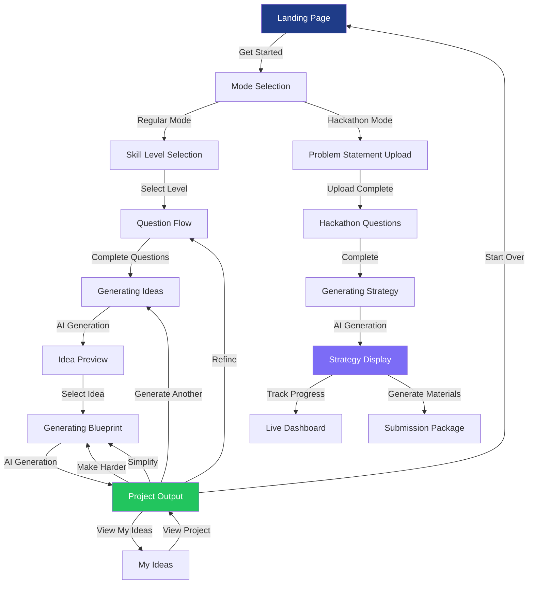
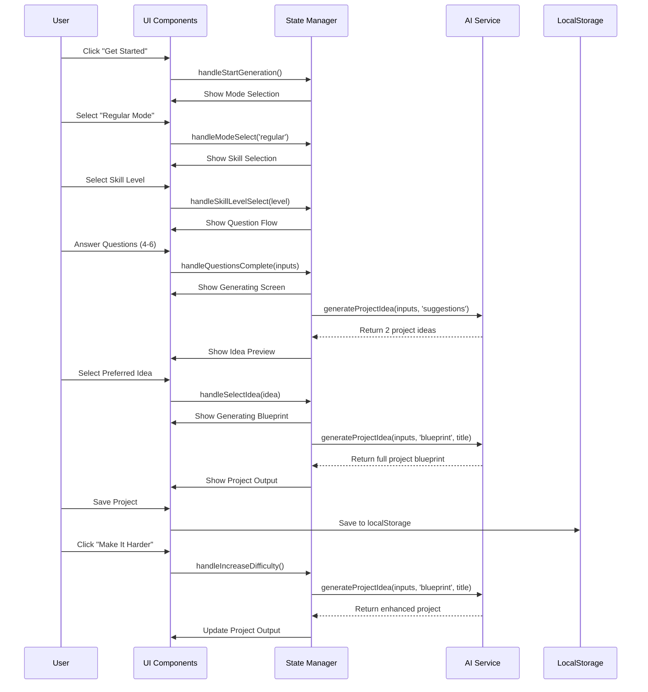
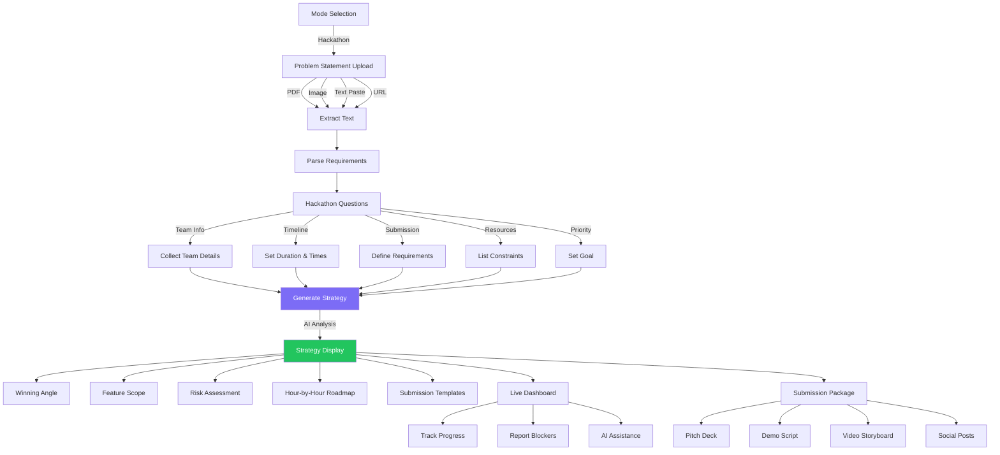
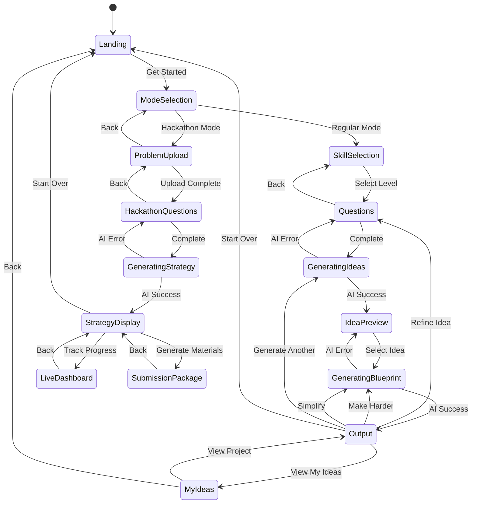
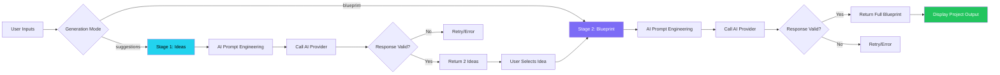
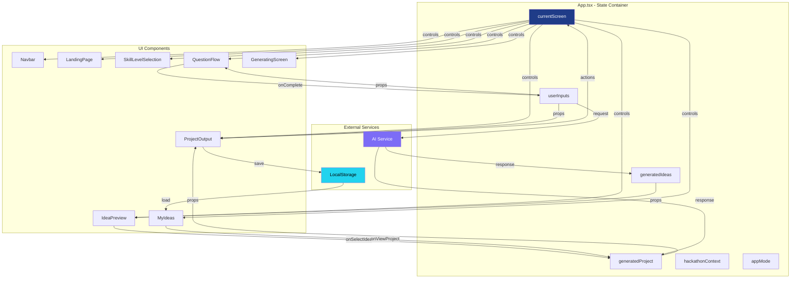
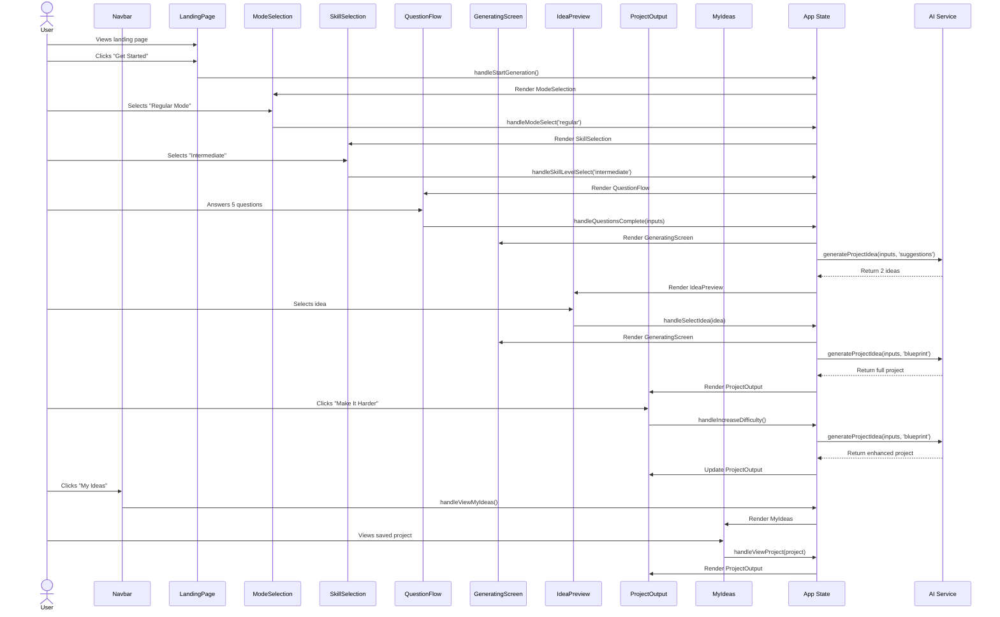
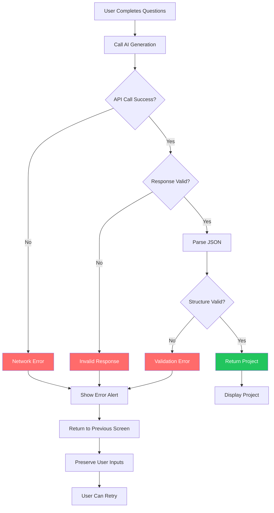
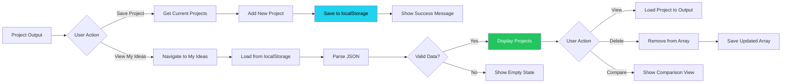
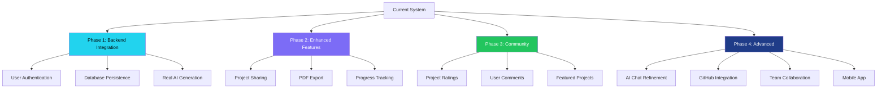

# IdeaZen System Flowcharts

## Overview

This document provides visual representations of the IdeaZen application flow using multiple diagram formats. These flowcharts help visualize user journeys, state transitions, and system operations.

**Version:** 1.2.0  
**Last Updated:** January 2025

---

## Table of Contents

1. [High-Level Application Flow](#high-level-application-flow)
2. [Regular Mode Detailed Flow](#regular-mode-detailed-flow)
3. [Hackathon Mode Flow](#hackathon-mode-flow)
4. [State Machine Diagram](#state-machine-diagram)
5. [AI Generation Flow](#ai-generation-flow)
6. [Data Flow Architecture](#data-flow-architecture)
7. [Component Interaction Diagram](#component-interaction-diagram)

---

## High-Level Application Flow

### Mermaid Diagram




### ASCII Diagram

```
┌─────────────────┐
│  Landing Page   │
└────────┬────────┘
         │ Get Started
         ▼
┌─────────────────┐
│ Mode Selection  │
└────┬───────┬────┘
     │       │
     │       └──────────────────────┐
     │ Regular                      │ Hackathon
     ▼                              ▼
┌─────────────────┐      ┌──────────────────────┐
│ Skill Selection │      │ Problem Upload       │
└────────┬────────┘      └──────────┬───────────┘
         │                          │
         ▼                          ▼
┌─────────────────┐      ┌──────────────────────┐
│ Question Flow   │      │ Hackathon Questions  │
└────────┬────────┘      └──────────┬───────────┘
         │                          │
         ▼                          ▼
┌─────────────────┐      ┌──────────────────────┐
│ Generating      │      │ Generating Strategy  │
│ (Ideas)         │      │                      │
└────────┬────────┘      └──────────┬───────────┘
         │                          │
         ▼                          ▼
┌─────────────────┐      ┌──────────────────────┐
│ Idea Preview    │      │ Strategy Display     │
└────────┬────────┘      └──────────┬───────────┘
         │                          │
         ▼                          ├─→ Live Dashboard
┌─────────────────┐                │
│ Generating      │                └─→ Submission Package
│ (Blueprint)     │
└────────┬────────┘
         │
         ▼
┌─────────────────┐
│ Project Output  │◄──────┐
└────┬────────────┘       │
     │                    │
     ├─→ Refine Idea      │
     ├─→ Make Harder      │
     ├─→ Simplify         │
     ├─→ Generate Another │
     ├─→ My Ideas ────────┘
     └─→ Start Over
```

---

## Regular Mode Detailed Flow

### Mermaid Sequence Diagram




### Step-by-Step Flow with Timing

```
┌──────────────────────────────────────────────────────────────┐
│ STEP 1: Landing Page (30 seconds)                           │
├──────────────────────────────────────────────────────────────┤
│ • User reads hero section                                    │
│ • Reviews "How It Works"                                     │
│ • Checks example projects                                    │
│ • Reads FAQ                                                  │
│ • Clicks "Get Started" CTA                                   │
└──────────────────────────────────────────────────────────────┘
                          ↓
┌──────────────────────────────────────────────────────────────┐
│ STEP 2: Mode Selection (10 seconds)                         │
├──────────────────────────────────────────────────────────────┤
│ • Choose Regular or Hackathon mode                           │
│ • Read mode descriptions                                     │
│ • Click to proceed                                           │
└──────────────────────────────────────────────────────────────┘
                          ↓
┌──────────────────────────────────────────────────────────────┐
│ STEP 3: Skill Level Selection (20 seconds)                  │
├──────────────────────────────────────────────────────────────┤
│ • AI recommends Beginner                                     │
│ • User reads descriptions                                    │
│ • Selects: Beginner / Intermediate / Advanced                │
│ • Card animates and glows                                    │
└──────────────────────────────────────────────────────────────┘
                          ↓
┌──────────────────────────────────────────────────────────────┐
│ STEP 4: Question Flow (1-2 minutes)                         │
├──────────────────────────────────────────────────────────────┤
│ Beginner: 4 questions                                        │
│   1. Domain (Web/Mobile/Game/Automation)                     │
│   2. Learning Goal (Frontend/Backend/Fullstack)              │
│   3. Time Availability (2 weeks - 3 months)                  │
│   4. Deployment Preference                                   │
│                                                              │
│ Intermediate: 5 questions                                    │
│   + Technology preferences (multi-select)                    │
│                                                              │
│ Advanced: 6 questions                                        │
│   + Architecture complexity                                  │
│   + Scalability requirements                                 │
│                                                              │
│ • Progress bar shows completion                              │
│ • Back button allows revision                                │
│ • Icons color-coded by meaning                               │
└──────────────────────────────────────────────────────────────┘
                          ↓
┌──────────────────────────────────────────────────────────────┐
│ STEP 5: Generating Ideas (3 seconds)                        │
├──────────────────────────────────────────────────────────────┤
│ • Animated gradient spinner                                  │
│ • Progress messages:                                         │
│   - Analyzing your inputs...                                 │
│   - Generating project options...                            │
│   - Validating feasibility...                                │
│   - Matching to skill level...                               │
│   - Finalizing suggestions...                                │
│ • AI generates 2 project ideas                               │
└──────────────────────────────────────────────────────────────┘
                          ↓
┌──────────────────────────────────────────────────────────────┐
│ STEP 6: Idea Preview (30-60 seconds)                        │
├──────────────────────────────────────────────────────────────┤
│ • 2 project cards displayed                                  │
│ • Each shows:                                                │
│   - Title                                                    │
│   - Difficulty badge                                         │
│   - Brief description                                        │
│   - First 3 features                                         │
│   - Confidence score                                         │
│ • User selects preferred idea                                │
└──────────────────────────────────────────────────────────────┘
                          ↓
┌──────────────────────────────────────────────────────────────┐
│ STEP 7: Generating Blueprint (3.5 seconds)                  │
├──────────────────────────────────────────────────────────────┤
│ • Different animation                                        │
│ • Progress messages:                                         │
│   - Analyzing requirements...            


### Step-by-Step Flow with Timing

```
Step 1: Landing Page (30s)
  → User explores features and examples
  → Clicks "Get Started"

Step 2: Mode Selection (10s)
  → Choose Regular or Hackathon
  → Proceeds to next screen

Step 3: Skill Level Selection (20s)
  → Select Beginner/Intermediate/Advanced
  → Determines question complexity

Step 4: Question Flow (1-2 min)
  → Answer 4-6 adaptive questions
  → Progress bar shows completion
  → Click "Generate Project Idea"

Step 5: Generating Ideas (3s)
  → AI generates 2 project suggestions
  → Animated loading with progress messages

Step 6: Idea Preview (30-60s)
  → Review 2 project options
  → Select preferred idea

Step 7: Generating Blueprint (3.5s)
  → AI creates detailed project plan
  → Animated loading with progress messages

Step 8: Project Output (5-10 min)
  → Review complete blueprint
  → AI reasoning, features, tech stack, roadmap
  → Use AI Mentor Controls to refine

Step 9: My Ideas (optional)
  → Save projects to history
  → Compare multiple projects
  → Reload saved projects
```

---

## Hackathon Mode Flow

### Mermaid Diagram




### ASCII Diagram - Hackathon Flow

```
┌─────────────────────┐
│ Problem Statement   │
│ Upload              │
└──────┬──────────────┘
       │
       ├─→ PDF Upload
       ├─→ Image Upload
       ├─→ Text Paste
       └─→ URL Input
       │
       ▼
┌─────────────────────┐
│ Extract & Parse     │
│ Requirements        │
└──────┬──────────────┘
       │
       ▼
┌─────────────────────┐
│ Hackathon Questions │
├─────────────────────┤
│ • Team (size/roles) │
│ • Timeline (hours)  │
│ • Submission reqs   │
│ • Resources/APIs    │
│ • Priority goal     │
└──────┬──────────────┘
       │
       ▼
┌─────────────────────┐
│ AI Strategy         │
│ Generation          │
└──────┬──────────────┘
       │
       ▼
┌─────────────────────┐
│ Strategy Display    │
├─────────────────────┤
│ • Winning Angle     │
│ • Feature Scope     │
│ • Risk Assessment   │
│ • Hour-by-Hour Plan │
│ • Work Streams      │
└──────┬──────────────┘
       │
       ├─────────────────────┐
       │                     │
       ▼                     ▼
┌─────────────────┐   ┌──────────────────┐
│ Live Dashboard  │   │ Submission       │
│                 │   │ Package          │
├─────────────────┤   ├──────────────────┤
│ • Progress      │   │ • Pitch Deck     │
│ • Time Tracking │   │ • Demo Script    │
│ • Blockers      │   │ • README         │
│ • AI Help       │   │ • Video Plan     │
│ • Team Sync     │   │ • Social Posts   │
└─────────────────┘   └──────────────────┘
```

---

## State Machine Diagram

### Complete State Transitions




### State Transition Table

| Current State | User Action | Next State | Handler Function |
|--------------|-------------|------------|------------------|
| landing | Get Started | mode-selection | handleStartGeneration() |
| mode-selection | Regular Mode | skill-selection | handleModeSelect('regular') |
| mode-selection | Hackathon Mode | problem-upload | handleModeSelect('hackathon') |
| skill-selection | Select Level | questions | handleSkillLevelSelect(level) |
| questions | Complete | generating | handleQuestionsComplete(inputs) |
| questions | Back | skill-selection | onBack() |
| generating | AI Success | idea-preview | (automatic) |
| generating | AI Error | questions | (error handler) |
| idea-preview | Select Idea | generating-blueprint | handleSelectIdea(idea) |
| generating-blueprint | AI Success | output | (automatic) |
| generating-blueprint | AI Error | idea-preview | (error handler) |
| output | Refine Idea | questions | handleRefineIdea() |
| output | Make Harder | generating-blueprint | handleIncreaseDifficulty() |
| output | Simplify | generating-blueprint | handleSimplifyProject() |
| output | Generate Another | generating | handleGenerateAnother() |
| output | View My Ideas | my-ideas | handleViewMyIdeas() |
| output | Start Over | landing | handleStartOver() |
| my-ideas | View Project | output | handleViewProject(project) |
| problem-upload | Complete | hackathon-questions | handleProblemStatementComplete() |
| hackathon-questions | Complete | generating-strategy | handleHackathonQuestionsComplete() |

---

## AI Generation Flow

### Two-Stage Generation Process



### AI Provider Selection

```
┌─────────────────────────────────────┐
│ AI Generation Request               │
└──────────────┬──────────────────────┘
               │
               ▼
┌─────────────────────────────────────┐
│ Check Environment Variables         │
├─────────────────────────────────────┤
│ • VITE_OPENAI_API_KEY              │
│ • VITE_ANTHROPIC_API_KEY           │
│ • VITE_GROQ_API_KEY                │
└──────────────┬──────────────────────┘
               │
               ▼
┌─────────────────────────────────────┐
│ Select Available Provider           │
├─────────────────────────────────────┤
│ Priority:                           │
│ 1. OpenAI (GPT-4)                  │
│ 2. Anthropic (Claude)              │
│ 3. Groq (Fast Inference)           │
└──────────────┬──────────────────────┘
               │
               ▼
┌─────────────────────────────────────┐
│ Construct Prompt                    │
├─────────────────────────────────────┤
│ • System role (expert mentor)       │
│ • User context (skill, goals)      │
│ • Task requirements                 │
│ • Output format (JSON)              │
└──────────────┬──────────────────────┘
               │
               ▼
┌─────────────────────────────────────┐
│ Call AI API                         │
├─────────────────────────────────────┤
│ • Timeout: 30 seconds               │
│ • Retry: 2 attempts                 │
│ • Error handling                    │
└──────────────┬──────────────────────┘
               │
               ▼
┌─────────────────────────────────────┐
│ Validate Response                   │
├─────────────────────────────────────┤
│ • Check JSON structure              │
│ • Verify required fields            │
│ • Validate data types               │
└──────────────┬──────────────────────┘
               │
               ▼
┌─────────────────────────────────────┐
│ Return Generated Project(s)         │
└─────────────────────────────────────┘
```


---

## Data Flow Architecture

### Component Data Flow



### Props Flow Diagram

```
App.tsx (State Container)
│
├─→ Navbar
│   ├─ onLogoClick: handleStartOver
│   ├─ onMyIdeasClick: handleViewMyIdeas
│   ├─ onGenerateClick: handleStartGeneration
│   └─ currentPage: derived from currentScreen
│
├─→ LandingPage
│   └─ onGetStarted: handleStartGeneration
│
├─→ ModeSelection
│   └─ onSelectMode: handleModeSelect
│
├─→ SkillLevelSelection
│   └─ onSelectLevel: handleSkillLevelSelect
│
├─→ QuestionFlow
│   ├─ skillLevel: userInputs.skillLevel
│   ├─ initialInputs: userInputs
│   ├─ onComplete: handleQuestionsComplete
│   └─ onBack: () => setCurrentScreen('skill-selection')
│
├─→ GeneratingScreen
│   └─ mode: 'ideas' | 'blueprint'
│
├─→ IdeaPreview
│   ├─ ideas: generatedIdeas[]
│   └─ onSelectIdea: handleSelectIdea
│
├─→ ProjectOutput
│   ├─ project: generatedProject
│   ├─ userInputs: userInputs
│   ├─ onRefine: handleRefineIdea
│   ├─ onIncreaseDifficulty: handleIncreaseDifficulty
│   ├─ onSimplify: handleSimplifyProject
│   ├─ onGenerateAnother: handleGenerateAnother
│   └─ onStartOver: handleStartOver
│
├─→ MyIdeas
│   └─ onViewProject: handleViewProject
│
├─→ ProblemStatementUpload
│   ├─ onComplete: handleProblemStatementComplete
│   └─ onBack: () => setCurrentScreen('mode-selection')
│
└─→ HackathonQuestions
    ├─ initialContext: hackathonContext
    ├─ onComplete: handleHackathonQuestionsComplete
    └─ onBack: () => setCurrentScreen('problem-upload')
```

---

## Component Interaction Diagram

### User Interaction Flow




---

## Question Flow Decision Tree

### Adaptive Questions by Skill Level

```
User Selects Skill Level
│
├─ BEGINNER (4 Questions)
│  │
│  ├─ Q1: What type of project?
│  │   ├─ Web Application
│  │   ├─ Mobile App
│  │   ├─ Game
│  │   └─ Automation Tool
│  │
│  ├─ Q2: What do you want to learn?
│  │   ├─ Frontend Development
│  │   ├─ Backend Development
│  │   ├─ Fullstack Development
│  │   └─ Specific Technology
│  │
│  ├─ Q3: How much time do you have?
│  │   ├─ 2 weeks
│  │   ├─ 1 month
│  │   ├─ 2 months
│  │   └─ 3 months
│  │
│  └─ Q4: Where will you deploy?
│      ├─ Local Machine
│      ├─ Cloud Platform
│      ├─ Both
│      └─ Not Sure Yet
│
├─ INTERMEDIATE (5 Questions)
│  │
│  ├─ Q1: What type of project?
│  │   ├─ Fullstack Application
│  │   ├─ API/Backend Service
│  │   ├─ Real-time Application
│  │   ├─ Mobile Application
│  │   └─ Developer Tools
│  │
│  ├─ Q2: What's your learning goal?
│  │   ├─ System Architecture
│  │   ├─ Performance Optimization
│  │   ├─ Testing & Quality
│  │   ├─ DevOps & Deployment
│  │   └─ New Technology
│  │
│  ├─ Q3: How much time available?
│  │   ├─ 1 month
│  │   ├─ 2 months
│  │   ├─ 3 months
│  │   ├─ 4-5 months
│  │   └─ 6 months
│  │
│  ├─ Q4: Which technologies? (Multi-select)
│  │   ├─ React / Vue / Angular
│  │   ├─ Node.js / Express
│  │   ├─ Python / Django / Flask
│  │   ├─ TypeScript
│  │   ├─ PostgreSQL / MongoDB
│  │   └─ Docker / Kubernetes
│  │
│  └─ Q5: Deployment requirements?
│      ├─ Simple Hosting
│      ├─ Scalable Cloud
│      ├─ Containerized
│      └─ Serverless
│
└─ ADVANCED (6 Questions)
   │
   ├─ Q1: What type of system?
   │   ├─ Distributed System
   │   ├─ ML/AI Platform
   │   ├─ DevOps/Infrastructure
   │   ├─ Blockchain Application
   │   └─ IoT System
   │
   ├─ Q2: Architecture complexity?
   │   ├─ Microservices
   │   ├─ Event-Driven
   │   ├─ Serverless
   │   ├─ Hybrid Architecture
   │   └─ Custom Design
   │
   ├─ Q3: Scalability requirements?
   │   ├─ Small Scale (< 1K users)
   │   ├─ Medium Scale (1K-10K)
   │   ├─ Large Scale (10K-100K)
   │   └─ Enterprise (100K+)
   │
   ├─ Q4: Technology preferences? (Multi-select)
   │   ├─ Go / Rust / Elixir
   │   ├─ Kubernetes / Docker
   │   ├─ GraphQL / gRPC
   │   ├─ Redis / RabbitMQ
   │   ├─ TensorFlow / PyTorch
   │   └─ AWS / GCP / Azure
   │
   ├─ Q5: Project timeline?
   │   ├─ 2-3 months
   │   ├─ 4-6 months
   │   ├─ 7-9 months
   │   └─ 10-12 months
   │
   └─ Q6: Constraints?
       ├─ Budget limitations
       ├─ Team size
       ├─ Compliance requirements
       └─ Performance targets
```

---

## Error Handling Flow

### AI Generation Error Recovery



### Error Recovery Paths

```
AI Generation Fails
│
├─ Network Error
│  ├─ Show: "Network connection failed"
│  ├─ Action: Return to questions screen
│  └─ State: Preserve all user inputs
│
├─ API Timeout (>30s)
│  ├─ Show: "Request timed out, please try again"
│  ├─ Action: Return to questions screen
│  └─ State: Preserve all user inputs
│
├─ Invalid API Key
│  ├─ Show: "Configuration error, please contact support"
│  ├─ Action: Return to questions screen
│  └─ State: Preserve all user inputs
│
├─ Rate Limit Exceeded
│  ├─ Show: "Too many requests, please wait"
│  ├─ Action: Return to questions screen
│  └─ State: Preserve all user inputs
│
├─ Malformed Response
│  ├─ Show: "Invalid response, please try again"
│  ├─ Action: Return to questions screen
│  └─ State: Preserve all user inputs
│
└─ Validation Error
   ├─ Show: "Generated project invalid, retrying"
   ├─ Action: Retry once, then return to questions
   └─ State: Preserve all user inputs
```

---

## LocalStorage Data Flow

### Save and Load Operations



### Storage Structure

```javascript
// localStorage key: 'ideazen-saved-projects'
{
  projects: [
    {
      title: "Project Title",
      difficulty: "Intermediate",
      description: "...",
      reasoning: "...",
      features: [...],
      techStack: {...},
      roadmap: [...],
      skillOutcomes: [...],
      feasibility: "High",
      confidence: "85%",
      savedAt: "2025-01-15T10:30:00Z"
    },
    // ... more projects
  ]
}
```

---

## Responsive Layout Flow

### Screen Size Adaptations

```
┌─────────────────────────────────────────────────────────┐
│ MOBILE (320px - 480px)                                  │
├─────────────────────────────────────────────────────────┤
│                                                         │
│  ┌─────────────────────────────────────────────────┐  │
│  │ Hamburger Menu                                   │  │
│  └─────────────────────────────────────────────────┘  │
│                                                         │
│  ┌─────────────────────────────────────────────────┐  │
│  │ Content (Single Column)                          │  │
│  │                                                  │  │
│  │ • Sidebar appears FIRST (order-1)               │  │
│  │ • Full width sections                           │  │
│  │ • Vertical timeline                             │  │
│  │ • Stacked cards                                 │  │
│  │ • Collapsed accordions                          │  │
│  └─────────────────────────────────────────────────┘  │
│                                                         │
└─────────────────────────────────────────────────────────┘

┌─────────────────────────────────────────────────────────┐
│ TABLET (768px - 1024px)                                 │
├─────────────────────────────────────────────────────────┤
│                                                         │
│  ┌─────────────────────────────────────────────────┐  │
│  │ Navbar (Some Links Visible)                     │  │
│  └─────────────────────────────────────────────────┘  │
│                                                         │
│  ┌──────────────────────┐  ┌──────────────────────┐  │
│  │ Content              │  │ Sidebar              │  │
│  │ (Two Columns)        │  │ (Starts Appearing)   │  │
│  │                      │  │                      │  │
│  │ • 2-column grids     │  │ • Moderate width     │  │
│  │ • Touch-friendly     │  │ • Not sticky yet     │  │
│  └──────────────────────┘  └──────────────────────┘  │
│                                                         │
└─────────────────────────────────────────────────────────┘

┌─────────────────────────────────────────────────────────┐
│ DESKTOP (1280px+)                                       │
├─────────────────────────────────────────────────────────┤
│                                                         │
│  ┌─────────────────────────────────────────────────┐  │
│  │ Navbar (All Links + Generate Button)            │  │
│  └─────────────────────────────────────────────────┘  │
│                                                         │
│  ┌──────────────────────────┐  ┌──────────────────┐  │
│  │ Main Content             │  │ Sticky Sidebar   │  │
│  │ (Multi-column)           │  │ (order-2)        │  │
│  │                          │  │                  │  │
│  │ • 3-column grids         │  │ • Fixed position │  │
│  │ • Horizontal timeline    │  │ • Always visible │  │
│  │ • Hover effects          │  │ • Full controls  │  │
│  │ • Expanded accordions    │  │                  │  │
│  └──────────────────────────┘  └──────────────────┘  │
│                                                         │
└─────────────────────────────────────────────────────────┘
```

---

## Future Enhancements Flow

### Planned Features



---

## Summary

This flowchart document provides comprehensive visual representations of the IdeaZen system flow, including:

- **High-level application flow** showing all major screens and transitions
- **Regular mode detailed flow** with step-by-step user journey
- **Hackathon mode flow** for competitive development scenarios
- **State machine diagram** showing all possible state transitions
- **AI generation flow** explaining the two-stage generation process
- **Data flow architecture** showing how data moves through components
- **Component interaction diagrams** illustrating props and callbacks
- **Question flow decision tree** showing adaptive questions by skill level
- **Error handling flow** demonstrating recovery mechanisms
- **LocalStorage operations** for project persistence
- **Responsive layout adaptations** across device sizes
- **Future enhancement roadmap** for planned features

These diagrams complement the SYSTEM_FLOW_AND_OPERATION.md document and provide visual references for developers, designers, and stakeholders.

---

**Related Documentation:**
- SYSTEM_FLOW_AND_OPERATION.md - Detailed technical documentation
- FRONTEND_ARCHITECTURE.md - Component architecture details
- PROJECT_OVERVIEW.md - High-level project vision
- API_SPECIFICATION.md - Backend integration requirements

---

**Version:** 1.2.0  
**Last Updated:** January 2025
